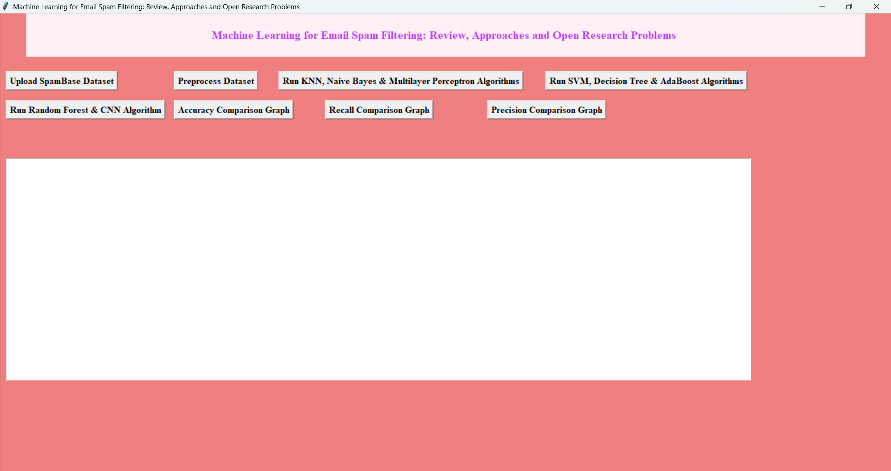
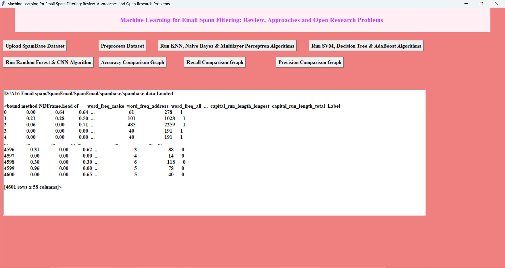
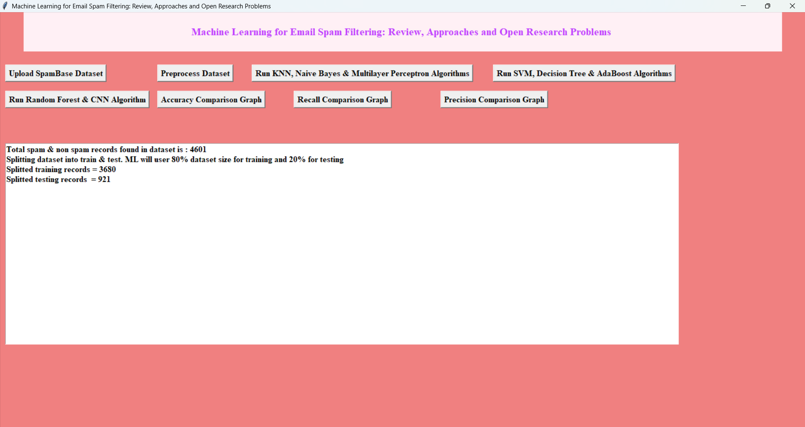
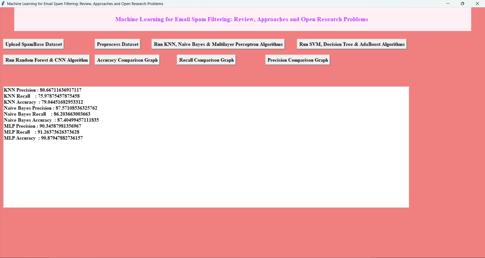
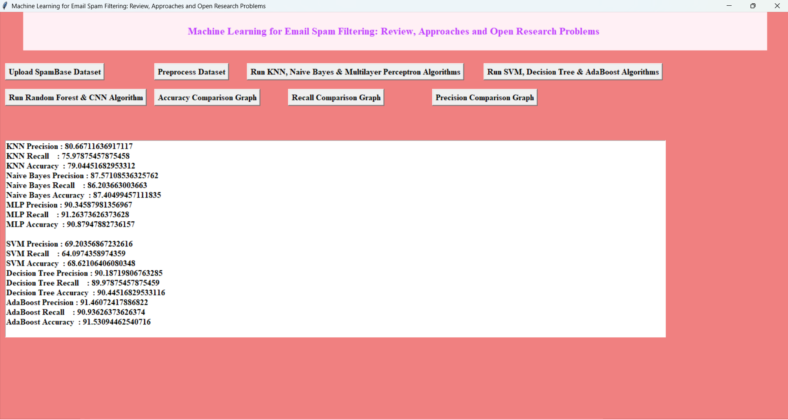
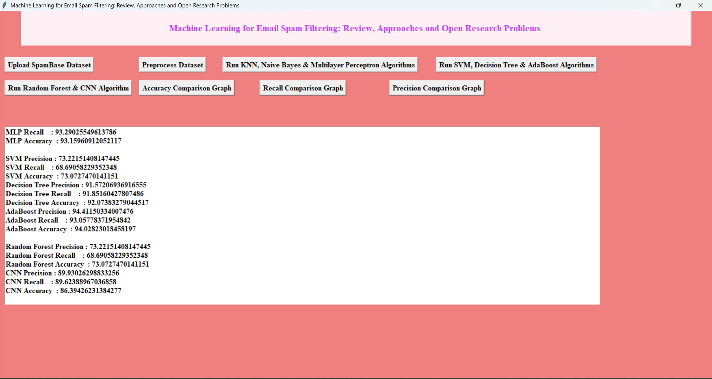
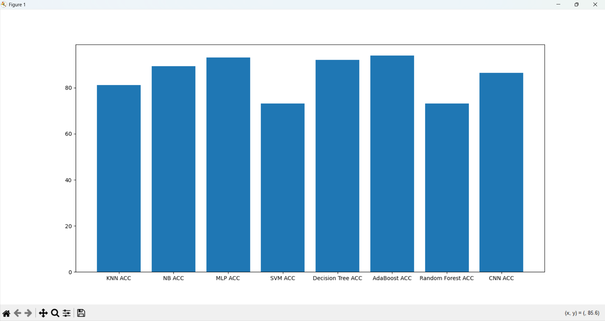
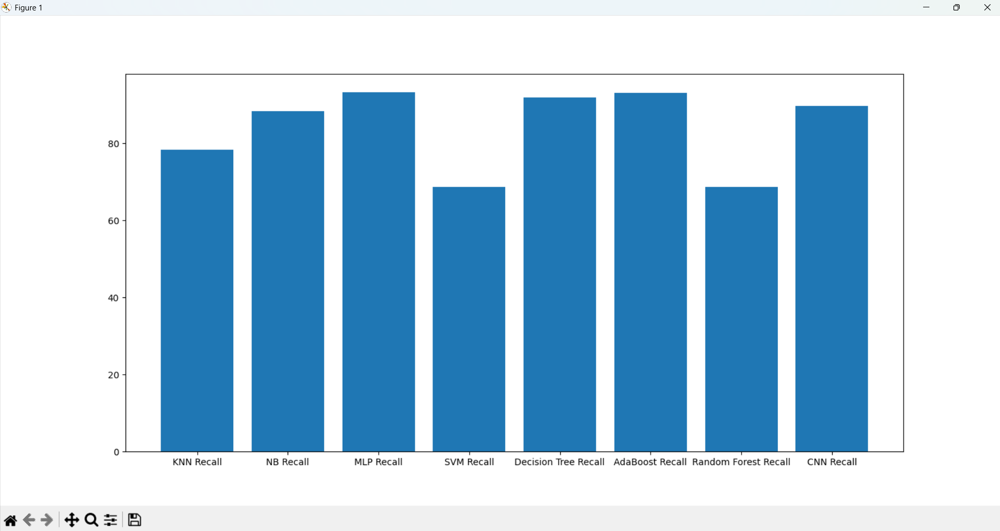
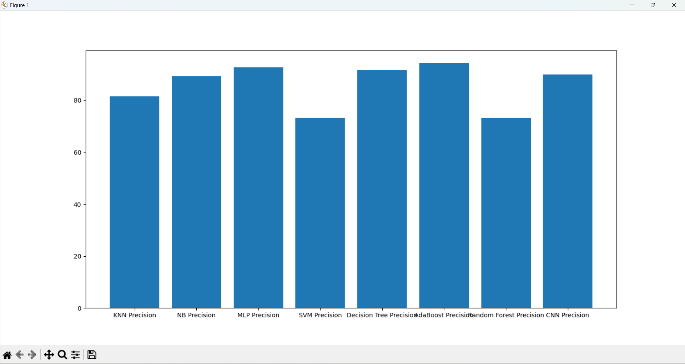

# 📧 Spam Email Classification using Machine Learning


A machine learning system that classifies emails as **Spam** or **Ham (Not Spam)** using eight different algorithms, with side-by-side performance comparison across Accuracy, Precision, and Recall.

---

## 🖼️ Screenshots

| Main Application | Dataset & Preprocessing |
|:---:|:---:|
|  |  |
|  | |

| Algorithm Results | |
|:---:|:---:|
|  |  |
|  | |

| Comparison Graphs | | |
|:---:|:---:|:---:|
|  |  |  |

---

## 📌 Project Overview

This project implements a **Spam Email Classification System** that trains and evaluates eight machine learning classifiers on the SpamBase dataset. Each model is benchmarked using Accuracy, Precision, and Recall, and results are visualized through comparison graphs — making it easy to identify the best-performing approach for real-world email filtering.

---

## 🎯 Objectives

- Classify incoming emails as Spam or Ham using supervised learning
- Compare the performance of eight ML algorithms on a common benchmark dataset
- Identify the best classifier based on standard evaluation metrics
- Provide an intuitive GUI for end-to-end workflow (upload → preprocess → train → visualize)

---

## 🛠️ Tech Stack

| Tool | Purpose |
|------|---------|
| Python 3.8+ | Core language |
| NumPy & Pandas | Data manipulation |
| Scikit-learn | Classical ML algorithms |
| Keras | CNN / Deep learning |
| Matplotlib | Graphs & visualization |
| Tkinter | Desktop GUI |

---

## 📂 Dataset

| Property | Detail |
|----------|--------|
| Name | SpamBase |
| Source | [UCI Machine Learning Repository](https://archive.ics.uci.edu/ml/datasets/spambase) |
| Records | 4,601 emails |
| Features | 57 numerical attributes + 1 class label |
| Split | 80% Training / 20% Testing |

---

## ⚙️ Algorithms Implemented

| # | Algorithm |
|---|-----------|
| 1 | K-Nearest Neighbors (KNN) |
| 2 | Naive Bayes (BernoulliNB) |
| 3 | Multilayer Perceptron (MLP) |
| 4 | Support Vector Machine (SVM) |
| 5 | Decision Tree |
| 6 | AdaBoost |
| 7 | Random Forest |
| 8 | Convolutional Neural Network (CNN) |

---

## 📊 Evaluation Metrics

Each model is evaluated on three metrics:

| Metric | Description |
|--------|-------------|
| **Accuracy** | Overall percentage of correct predictions |
| **Precision** | Of all emails flagged as spam, how many actually were |
| **Recall** | Of all actual spam emails, how many were correctly caught |

Results are plotted in side-by-side bar graphs for easy comparison.

---

## 🏆 Results

**MLP (Multilayer Perceptron)** achieved the best overall performance, ranking highest in Accuracy, Precision, and Recall across all classifiers tested.

---

## 🖥️ Application Workflow

```
1. Upload SpamBase Dataset (.data file)
       ↓
2. Preprocess Dataset (cleaning + train/test split)
       ↓
3. Run KNN, Naive Bayes, MLP
       ↓
4. Run SVM, Decision Tree, AdaBoost
       ↓
5. Run Random Forest, CNN
       ↓
6. Generate Accuracy, Recall & Precision comparison graphs
```

---

## ▶️ Getting Started

### Prerequisites

- Python 3.8 or higher
- pip

### Installation

```bash
# 1. Clone the repository
git clone https://github.com/sanjay-narra/Spam-Email-Classifier.git
cd Spam-Email-Classifier

# 2. Create and activate a virtual environment
python -m venv venv
venv\Scripts\activate        # Windows
# source venv/bin/activate   # macOS / Linux

# 3. Install dependencies
pip install -r requirements.txt

# 4. Launch the application
python SpamFilter.py
```

### Usage

1. Click **Upload SpamBase Dataset** and select `spambase.data`
2. Click **Preprocess Dataset**
3. Run each group of algorithms using the respective buttons
4. Generate comparison graphs for Accuracy, Recall, and Precision

---

## 🔮 Future Enhancements

- [ ] Advanced deep learning models (LSTM, BERT)
- [ ] Real-time email classification
- [ ] Integration with email clients (Gmail, Outlook)
- [ ] Improved GUI design and interactive visualizations
- [ ] Web application deployment

---

## 👨‍💻 Author

**Narra Sanjay** — B.Tech Computer Science Engineering (2026)

[](https://github.com/sanjay-narra)
[](mailto:narrasanjayigy7@gmail.com)

---

## 📄 License

This project is licensed under the [MIT License](LICENSE).
